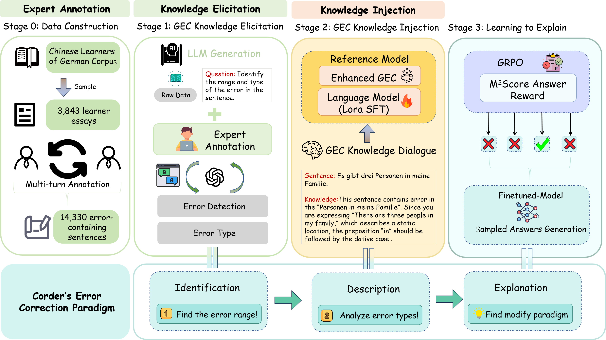
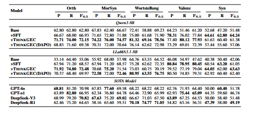
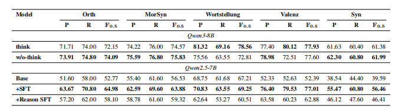

# THINKGEC: A Cognitive and Pedagogical Framework for LLM-based Grammatical Error Correction


> This repository contains the code and dataset for the paper **"THINKGEC: A Cognitive and Pedagogical Framework for LLM-based Grammatical Error Correction"**.


## 📌 Overview

Large Language Models (LLMs) are increasingly used for learner-facing writing support, yet **Grammatical Error Correction (GEC)** still lacks:
- **Cognitively aligned training**
- **Pedagogically curated data**
- **Interpretable feedback**

We propose **THINKGEC**, a three-stage framework grounded in Corder’s *identification–description–explanation* paradigm:
1. **Knowledge Elicitation**: Expert-annotated error explanations
2. **Knowledge Injection**: Supervised fine-tuning with pedagogical signals
3. **Explanation via Self-Revision**: GRPO-guided revision with rationale generation

To support this framework, we release **De10K** — an education-oriented German GEC corpus with:
- **2,899 essays**
- **14,330 expert-annotated errors**

Our approach **outperforms strong baselines**, improves **precision**, **reduces over-correction**, and **generalizes** to unseen semantic error types.


---

## 🗂️ Dataset: De10K

**De10K** is the first German GEC corpus that includes:
- Error correction
- Error type labels (e.g., verb tense, article misuse)
- **Pedagogical explanations** written by large language model

> 🔒 *Due to anonymity and licensing, the dataset will be released upon paper acceptance. Please check back or contact the authors via the ACL ARR system.*

---

## 🧠 Method Highlights

- **Cognitive Alignment**: Mirrors how learners understand and internalize corrections
- **Minimal & Meaning-Preserving Edits**: Avoids unnecessary rewriting
- **Interpretable Rationales**: Each correction is accompanied by a natural-language explanation

---

## 🚀 Getting Started

#### 1. Prepare API Configuration

Prepare your own API key and base URL inside `api_appliment/api_appliment.py` to call the model.

```python
client = OpenAI(
    api_key="your api key here",
    base_url="your base url here"
)
```

#### 2. Implement Knowledge Injection by launching the SFT script.

```bash
llamafactory-cli train LLaMA-Factory\examples\train_lora\qwen3_lora_sft.yaml
```

NOTE: The model\data path should be your local path!

#### 3. Running GRPO to achieve the reason trajectory for grammar error correction

```bash
bash verl-main\examples\grpo_trainer\run_qwen3_8b_llm.sh
```

🧪Performance on Different Settings

<details>
<summary>Results with/without reason trajectory in SFT</summary>




</details>

<details>
<summary>Results with/without reason trajectory in GRPO</summary>


